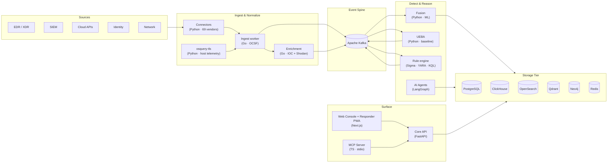

# AiSOC

An open-source, self-hostable AI SOC. The agent's prompts, tool calls, and rationale are logged step-by-step and replayable. MIT-licensed.

The community-maintained demo at <a href="https://tryaisoc.com">tryaisoc.com</a> runs on Fly.io and can go offline; see <a href="docs/operations/live-demo-runbook.md">docs/operations/live-demo-runbook.md</a> and use Codespaces as the always-on fallback.

 

<em>90-second walkthrough — agent investigates the seeded LockBit 3.0 case end-to-end. The rendered <code>.mp4</code> + <code>hero.gif</code> land with the v8.0 launch; the brief is in <a href="docs/demo/SCREENCAST_SHOTLIST.md">docs/demo/SCREENCAST_SHOTLIST.md</a>.</em>

---

## Try AiSOC in 60 seconds

Four fastest paths to a working AiSOC investigation. Pick whichever matches what you already have on your machine:

| If you have…                          | Run this                                                                                                 | What you get                                                                                       |
|---------------------------------------|----------------------------------------------------------------------------------------------------------|----------------------------------------------------------------------------------------------------|
| **Python 3.10+** (no Docker)          | `pip install -e packages/aisoc-sandbox && aisoc-sandbox demo`                                            | Offline agent investigation walked through Detect → Triage → Hunt → Respond and printed to stdout. **< 5 s.** No API key, no network. |
| **A browser** (zero install)          | [Open in Codespaces](https://codespaces.new/beenuar/AiSOC?quickstart=1)                                  | Browser IDE → `pnpm aisoc:demo --no-open` → click forwarded port `3000`. ~5 min cold.              |
| **Docker + pnpm**                     | `git clone https://github.com/beenuar/AiSOC && cd AiSOC && pnpm aisoc:demo`                              | Local stack on Postgres + Redis + Kafka + api + agents + web. Browser opens at `INC-RT-001`.       |
| **Nothing** (clean Linux/macOS/Win)   | `curl -fsSL https://raw.githubusercontent.com/beenuar/AiSOC/main/install.sh \| bash`                     | Bootstraps Docker, Node, pnpm, git for you; then runs `pnpm aisoc:demo`.                           |

The first row is new: [`aisoc-sandbox`](packages/aisoc-sandbox/) is a zero-dependency, in-memory simulator of the agent funnel. Pick a [bundled scenario](packages/aisoc-sandbox/README.md#bundled-scenarios) (`lateral-movement`, `aws-credential-exfil`, `phishing-payload`, `kubernetes-privesc`, `github-token-theft`) or feed in your own JSON via `--file`. The other three rows boot the real stack and land you on `/cases/INC-RT-001?tab=ledger` — a LockBit 3.0 ransomware case mid-investigation, with the AI agent's prompts, tool calls, and rationale streaming into the [Investigation Ledger](apps/docs/docs/console/investigation-rail.md). Stop the real stack with `pnpm aisoc:demo:down`.

> **Does the demo still boot on `main`?** Every push runs [`compose-smoke`](https://github.com/beenuar/AiSOC/actions/workflows/compose-smoke.yml) (the same `pnpm aisoc:demo` path you'd run locally) and [`e2e`](https://github.com/beenuar/AiSOC/actions/workflows/e2e.yml) against the seeded console; nightly [`compose-smoke-nightly`](https://github.com/beenuar/AiSOC/actions/workflows/compose-smoke-nightly.yml) repeats it with cold caches. A red badge below is a release-blocker.
>
> 
> 
> 

Full multi-platform deploy guide is in [`apps/docs/docs/installation.md`](apps/docs/docs/installation.md) (Render, Fly.io, Docker Compose, Kubernetes, Terraform). Production-grade install with full storage tier: [`infra/helm/`](infra/helm/) or [`infra/terraform/`](infra/terraform/).

---

## What AiSOC is

AiSOC is a single self-hostable stack that ingests security events, correlates them, runs AI-driven investigation, and surfaces the result in a SOC console. The agent and the substrate are MIT-licensed, so you can read, fork, or replace either of them.

Three properties distinguish it from closed-source AI SOC vendors:

1. **Agent decisions are logged.** The Investigation Ledger stores the LLM prompt, the response, the evidence cited, and the downstream tool calls for every step of every run. Replays are available later.
2. **The substrate has a public eval harness in CI.** Five suites gate every PR targeting `main` / `develop` — alert reduction is a real measurement against a fixed 1 000-alert stream; three rubric-based suites are substrate self-consistency gates over a deterministic 200-incident dataset (55 templates) with per-template macros; a fifth gate validates the backing telemetry corpus. The [benchmark page](apps/docs/docs/benchmark.md) documents exactly what each suite measures and what it does not.
3. **You control what leaves your perimeter.** No callbacks to a vendor cloud and no "model improvement" telemetry. With a hosted LLM, evidence is pseudonymized by default (internal IPs, hostnames, emails, paths, secrets, usernames become opaque tokens); run a local model (Ollama/vLLM) for a fully air-gapped path. Exactly what leaves under each mode: [`docs/trust/data-flows.md`](docs/trust/data-flows.md).

The orchestrator is a ~600-line LangGraph in [`services/agents/`](services/agents/). It is small enough to read end-to-end, swap models in, and patch.

---

## How AiSOC compares

| Capability | AiSOC | Wazuh | Splunk ES | Closed-source AI SOC |
|---|---|---|---|---|
| Open-source license | MIT | GPL-2 | proprietary | proprietary |
| Self-hostable | yes | yes | enterprise-only | cloud-only |
| Autonomous AI investigation | LangGraph | no | partial (Splunk AI) | yes |
| Agent decision audit trail | public Investigation Ledger | n/a | n/a | not published |
| Public substrate eval harness | CI-gated, reproducible, with synthetic telemetry corpus + per-template macros | n/a | n/a | not published |
| Detection content | 939 executable (861 native) + 6 000-rule provenance-tracked imported library ([truth table](docs/detections/truth-table.md)) | 1 200+ rules | 1 000+ apps | curated |
| Plugin SDK | Python / TypeScript / Go | YAML rules only | apps | proprietary |
| Data residency | your infra | your infra | partial | vendor cloud |
| Pricing | $0 (self-host) | $0 (self-host) | per ingest GB | enterprise |

Closed-source AI SOC vendors ship working products. AiSOC's contribution is making the agent itself open, the per-step decision trail readable, and the substrate gated by a public eval harness on every PR targeting `main` / `develop`.

---

## What you'll see in the console

|  |  |
|:---:|:---:|
| **Alerts queue** — server-anchored SLA countdowns, atomic claim, one-click triage. [Docs](apps/docs/docs/console/queue.md) | **Investigation Rail** — narrative, pivot-path entity chips, 6-event timeline, recommended actions. [Docs](apps/docs/docs/console/investigation-rail.md) |
|  |  |
| **`/hunt` workbench** — type a hypothesis in English, get ES&#124;QL / SPL / KQL back, save + schedule. [Docs](apps/docs/docs/console/rule-tuning.md) | **Marketplace** — plugins, playbooks, detections with one-click tenant install. [Docs](apps/docs/docs/plugins/overview.md) |

<em>The four tiles above are SVG placeholders. Real PNG screenshots ship with the next Phase 2 visuals rollup; the [walkthrough video](apps/web/public/demo/) at the top of this README is the canonical reference until then.</em>

---

## Architecture

Full architecture (every service, every storage role, the v1.5 console workbench, and the Investigation Ledger contract) is in [`apps/docs/docs/architecture.md`](apps/docs/docs/architecture.md). The deeper system-design write-up — including ML fusion, the Neo4j-at-ingest schema, and the threat-intel pipeline — lives at [`docs/architecture/SYSTEM_DESIGN.md`](docs/architecture/SYSTEM_DESIGN.md). The full monorepo layout is at [`apps/docs/docs/architecture/overview.md`](apps/docs/docs/architecture/overview.md).

---

## What's in the box

A handful of headline capabilities — the rest are catalogued in [`apps/docs/docs/features/`](apps/docs/docs/features/) and indexed at the top of [`apps/docs/docs/intro.md`](apps/docs/docs/intro.md):

> **Maturity.** Connectors, Investigation Rail + Ledger, and Hunt-as-Code are GA. Detection-as-Code and L0–L4 autonomy are beta (eval-gate and rollback/post-action-verification hardening in progress). The live-agent benchmark is preview; the substrate eval suites are GA. Full per-claim status: [`docs/audit/REALITY_REPORT.md`](docs/audit/REALITY_REPORT.md).

- **77 click-and-connect data connectors** (EDR/XDR, SIEM, cloud, CNAPP, identity, SaaS, VCS, K8s audit, network) with schema-driven config, live `Test connection`, and vault-encrypted secrets. Walkthrough: [`apps/docs/docs/connectors/index.md`](apps/docs/docs/connectors/index.md).
- **Investigation Rail + replayable Investigation Ledger** — every prompt, tool call, evidence chip, and rationale stored against a case, replayable in the UI. [`apps/docs/docs/console/investigation-rail.md`](apps/docs/docs/console/investigation-rail.md).
- **Detection-as-Code lifecycle** — propose → review → eval-gate → promote; CI rejects any candidate that fails its own positive/negative fixtures (the non-circular gate) or regresses MITRE accuracy. [`apps/docs/docs/concepts/detections.md`](apps/docs/docs/concepts/detections.md) — and the 861 native rules live in [`detections/`](detections/).
- **L0–L4 automation maturity** — gate every autonomous action on per-action confidence thresholds and blast-radius. [`apps/docs/docs/concepts/automation-maturity.md`](apps/docs/docs/concepts/automation-maturity.md).
- **Hunt-as-Code** — YAML hypotheses with MITRE tags, cron schedules, and natural-language `/hunt` workbench. [`hunts/`](hunts/) + [`apps/docs/docs/console/rule-tuning.md`](apps/docs/docs/console/rule-tuning.md).
- **Public weekly benchmark scoreboard** — the same harness that gates PRs, run weekly against `main`. [`apps/docs/docs/benchmark-scoreboard.mdx`](apps/docs/docs/benchmark-scoreboard.mdx).

---

## Use it from Claude, Cursor, or Cody

AiSOC ships an [MCP server](https://modelcontextprotocol.io) (`services/mcp/`) so analysts can query alerts, run agent investigations, and replay every step the agent took without leaving the IDE or chat. The server exposes 13 tools — discovery, deep-dive, governed lake query, and the action / replay set that walks the agent decision ledger step-by-step.

> **Status — monorepo source build today; npm publish lands in v8.0.** Full setup is in [`apps/docs/docs/integrations/mcp.md`](apps/docs/docs/integrations/mcp.md), which shows the today-vs-v8.0 invocations side by side.

---

## Extend it

Three contribution surfaces; each is one file plus optional fixtures, and CI validates every PR.

- **Detection rule.** Drop a Sigma YAML under [`detections/`](detections/) with a positive / negative fixture in [`detections/fixtures/`](detections/fixtures/). The [validate-detections](https://github.com/beenuar/AiSOC/actions/workflows/validate-detections.yml) workflow tests it on every PR. Spec: [`docs/connectors/`](apps/docs/docs/connectors/).
- **Connector.** Subclass `BaseConnector` in [`services/connectors/app/connectors/`](services/connectors/app/connectors/), register it in `_CONNECTOR_CLASSES`, and add a `plugins/<id>/plugin.yaml` manifest. The marketplace picks it up automatically. Walkthrough: [`apps/docs/docs/connectors/`](apps/docs/docs/connectors/).
- **Playbook.** Drop a YAML under [`playbooks/`](playbooks/); [`validate-playbooks`](https://github.com/beenuar/AiSOC/actions/workflows/validate-playbooks.yml) gates the PR. Schema: [`playbook.schema.json`](playbook.schema.json).

Plugin and detection SDK (Python · TypeScript · Go) — see [`apps/docs/docs/plugins/overview.md`](apps/docs/docs/plugins/overview.md). The CLI (`aisoc-cli`) is in [`packages/aisoc-cli/`](packages/aisoc-cli/); PyPI publish lands in v8.0.

---

## Roadmap & releases

- **Latest GitHub release with downloads:** <https://github.com/beenuar/AiSOC/releases/latest>
- **Per-release narrative:** [`RELEASES.md`](RELEASES.md) (mirrors what used to live in this README)
- **Machine-readable inventory with file paths, env-var diffs, test counts:** [`CHANGELOG.md`](CHANGELOG.md)
- **v8.0 wave-2 in flight (`[~]` items):** [`docs/roadmap/v8-progress.md`](docs/roadmap/v8-progress.md)
- **Bigger-picture roadmap (BYOC multi-cloud, MSSP rollups, federated search):** [`ROADMAP.md`](ROADMAP.md)

---

## Contributing

PRs of every size are welcome. Read [`CONTRIBUTING.md`](CONTRIBUTING.md) for the workflow and the [Code of Conduct](CODE_OF_CONDUCT.md) before opening a PR.

First-time contributors: pick a [`good first issue`](https://github.com/beenuar/AiSOC/issues?q=is%3Aopen+label%3A%22good+first+issue%22). Need help? [Open a Q&A discussion](https://github.com/beenuar/AiSOC/discussions/new?category=q-a).

---

## Credits

AiSOC is built and improved by a growing community of contributors, security researchers, and operators. The full attribution — including bug reporters and security researchers — lives in [`.github/CREDITS.md`](.github/CREDITS.md). The always-up-to-date code-contribution graph is on the [GitHub contributors page](https://github.com/beenuar/AiSOC/graphs/contributors).

---

## Security

For security issues, please do not open a public issue. Use [GitHub's private vulnerability reporting](https://github.com/beenuar/AiSOC/security/advisories/new). Full policy in [`SECURITY.md`](SECURITY.md). AiSOC follows coordinated disclosure.

---

## License

[MIT](LICENSE) — © 2024–present AiSOC contributors.

[Report a bug](https://github.com/beenuar/AiSOC/issues/new?template=bug_report.yml) · [Request a feature](https://github.com/beenuar/AiSOC/issues/new?template=feature_request.yml) · [Contribute](CONTRIBUTING.md) · [Read the docs](apps/docs/) · [Reproduce the benchmark](apps/docs/docs/benchmark.md)

