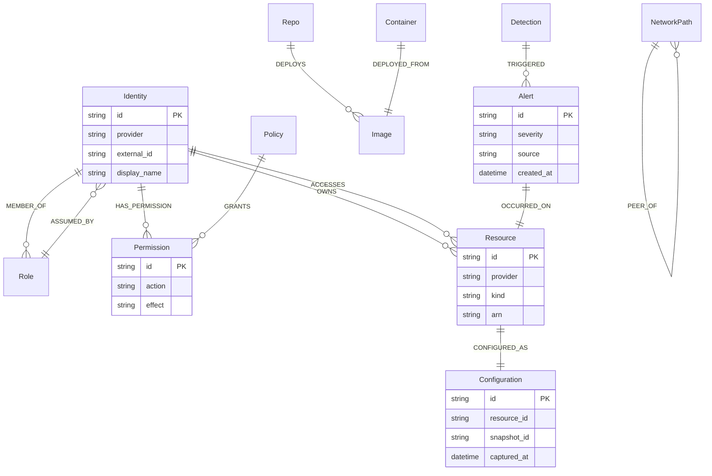

# Security knowledge graph schema

AiSOC writes a security knowledge graph **at ingest time**, not at query time. Every alert, identity-assume, access event, and configuration snapshot lands in Neo4j as a graph fact, and downstream surfaces — the case console, the Effective Permissions view, the Attack Chains view, the agent's pre-fetched context bundle — read that graph instead of replaying raw events.

This page is the canonical reference for the schema:

- **Why** we maintain a graph and what the design centre is.
- **Every node label** that ingest may write, and the properties it carries.
- **Every relationship type** that ingest may write, the source → target labels, and the properties on the edge.
- The **event-edge convention** that lets us reconstruct "what did the world look like at time T?" without ever reading the raw event stream again.
- The **versioning** and **CI drift gate** that keep this doc, the Go source, and the live database from drifting apart.

The machine-readable source of truth lives at [`schemas/graph-schema.yaml`](https://github.com/beenuar/AiSOC/blob/main/schemas/graph-schema.yaml) and is enforced in CI by `scripts/export_graph_schema.py --check`.

## Why we need a security knowledge graph at ingest time

Traditional SIEMs answer "what happened?" by replaying time-bounded slices of an event log. That works for individual queries but collapses at the questions security teams actually ask during an incident:

- "What can this compromised identity reach **right now**?"
- "Which other endpoints share the same image, the same network segment, the same OAuth grant?"
- "What did this resource's configuration look like at the time the alert fired — not now, **then**?"
- "Which deny policies sit between the attacker's principal and the crown-jewel resource?"

Each of those questions is a graph traversal. Doing the traversal on raw events at query time costs seconds per hop and gets slower as the event store grows. Materialising the graph at ingest time pushes that cost to write-side once, where it amortises across every future query.

Just as important, the graph is the **shared substrate** the agent uses to build context. When the agent investigates an alert, it doesn't search logs — it walks the graph from the alert's `:OCCURRED_ON` anchor outward through `:ACCESSES`, `:HAS_PERMISSION`, `:PEER_OF`, and `:MEMBER_OF` edges, and the result is bounded, audit-able, and reproducible. The graph is what makes the L0–L4 autonomy claim defensible.

The schema is intentionally small — 17 node labels, 14 relationship types — and intentionally split into **structural edges** (what *is*, from configuration snapshots) and **event edges** (what *happened*, from observed events). Every event edge carries `ts`, `source_event_id`, and `snapshot_id` so any state can be reconstructed at any point in time.

## Schema at a glance



The diagram intentionally shows only the twelve most-traversed relationships for readability. The full set of fourteen is documented below, and the YAML spec is exhaustive.

## Node labels

Each subsection covers one node label: what real-world thing it represents, when ingest creates it, and the properties it carries. Properties marked **required** are guaranteed to be present; the rest are best-effort.

### `Identity`

The superclass label every authenticatable principal carries. A node with the `User` or `ServiceAccount` label always also carries `Identity` so cross-IdP queries can ignore the subclass distinction.

- **Created when**: any IdP, IAM, or audit-log connector first reports a principal.
- **Properties**: `id` (required), `provider` (required), `external_id` (required), `display_name`, `email`, `created_at`, `last_seen_at`.

### `User`

A human principal. Carries both `User` and `Identity`. Sourced from Entra, Okta, Google Workspace, Jumpcloud, on-prem AD, etc. `manager_id` is populated when the IdP exposes org structure — used by the agent to expand approval chains and to compute "this department's blast radius".

- **Created when**: an HR / IdP connector reports a person.
- **Properties**: `id` (required), `email`, `display_name`, `department`, `manager_id`, `status`.

### `ServiceAccount`

A non-human principal — bot, CI runner, workload identity, IAM role assumed programmatically. Carries both `ServiceAccount` and `Identity`. `owner_user_id` links back to the human responsible for the account, which the agent uses when proposing an approver for high-blast-radius actions.

- **Created when**: an IAM / Kubernetes / GitHub-App connector reports a non-human principal.
- **Properties**: `id` (required), `provider` (required), `kind`, `owner_user_id`, `created_at`.

### `Role`

A named bundle of permissions — IAM role, Entra role, GitHub team, Kubernetes RBAC role. The graph treats roles as nodes (rather than properties on Identity) so an identity's membership chain is queryable and so role-deletion is a single delete.

- **Created when**: an IAM connector reports a role definition.
- **Properties**: `id` (required), `provider` (required), `name` (required), `scope`, `kind`.

### `Permission`

A single primitive capability — `s3:GetObject`, `read:packages`, `Microsoft.Compute/virtualMachines/start`. The atomic unit that policies grant. Permission nodes are deduplicated across the tenant: there is exactly one `s3:GetObject` Permission node per provider.

- **Created when**: an IAM connector reports a permission referenced by a policy.
- **Properties**: `id` (required), `provider` (required), `action` (required), `effect`.

### `Policy`

A named document that grants one or more Permissions, optionally scoped to a Resource. The provider-side artefact (IAM policy JSON, Entra policy, Kubernetes Role). `document` carries the raw JSON for auditability; the graph also materialises the policy → permission edges explicitly so traversal is cheap.

- **Created when**: an IAM connector reports a policy definition.
- **Properties**: `id` (required), `provider` (required), `name` (required), `document`, `managed`, `updated_at`.

### `Resource`

Any IaaS, PaaS, or SaaS object that can be the subject or object of a permission — S3 bucket, VM, Snowflake table, GitHub repo, Confluence page. The superclass label that `Repo` and `SaaSApp` subclass nodes also carry, so "list everything this identity can reach" is a single hop regardless of the underlying resource kind.

- **Created when**: a connector first reports a resource (often during the initial inventory pass; subsequently when a new resource appears in an event).
- **Properties**: `id` (required), `provider` (required), `kind` (required), `arn`, `region`, `tenant`, `tags`, `created_at`.

### `Configuration`

A point-in-time configuration snapshot of a Resource — bucket policy, VM extension list, repo branch-protection rules, OAuth app scopes. Pinned by `snapshot_id` (which propagates onto every event edge written in the same ingest window) so the graph can answer "what did this look like at the time of the alert?".

- **Created when**: a configuration-snapshot ingest pass (T1.2) runs. Either scheduled or triggered by a change-event from the same connector.
- **Properties**: `id` (required), `resource_id` (required), `snapshot_id` (required), `captured_at` (required), `source` (required), `payload_hash`.

### `Endpoint`

A device — laptop, server, EC2 instance, mobile, kiosk. Carries enough identity (`hostname`, `serial`, `provider`) to dedupe across overlapping EDR, MDM, and cloud-inventory feeds. Anchors on-host events (process, file, network) via `:OCCURRED_ON`.

- **Created when**: an EDR, MDM, or cloud-inventory connector first reports a device.
- **Properties**: `id` (required), `hostname`, `os`, `provider`, `serial`, `enrolled`, `last_seen_at`.

### `Repo`

A source-code repository — GitHub, GitLab, Bitbucket. Subclass of `Resource`. Roots software-supply-chain queries through `:DEPLOYS` to the Images shipped, and through `:OWNS` to the Identity responsible.

- **Created when**: a VCS connector first reports a repository.
- **Properties**: `id` (required), `provider` (required), `full_name` (required), `default_branch`, `visibility`.

### `Container`

A running container instance — Kubernetes Pod container, ECS task, `docker run` invocation. Connects an `Image` (what is running) to the `Endpoint` (where it is running). Short-lived nodes; ingest writes `ended_at` when a stop signal is observed.

- **Created when**: a Kubernetes-audit, ECS, or container-runtime connector reports a container lifecycle event.
- **Properties**: `id` (required), `name`, `pod`, `namespace`, `started_at`, `ended_at`.

### `Image`

A container image artefact — `registry/org/name@sha256:...`. The graph treats the digest as the identity (`digest` is required), so retagging the same image doesn't fork the node and CVE-to-running-container queries stay a single hop.

- **Created when**: a registry connector reports a push, or a Kubernetes-audit event references an unseen digest.
- **Properties**: `id` (required), `digest` (required), `registry`, `tag`, `pushed_at`.

### `NetworkPath`

A reachable network edge between two endpoints (or endpoint and CIDR) observed from flow logs, service-mesh telemetry, or firewall configuration. Distinct from a single connection event — it represents *reachability* over a window, which is what blast-radius queries need.

- **Created when**: a network-flow or firewall-config connector reports a path; the path is re-materialised per snapshot.
- **Properties**: `id` (required), `protocol`, `port`, `direction`, `observed_at`.

### `SaaSApp`

A third-party SaaS application registered against the tenant — OAuth app, marketplace integration, OIDC client. Subclass of `Resource` so SaaS apps appear in the same access-graph queries as cloud resources.

- **Created when**: an IdP, OAuth-token, or SaaS-admin connector reports the app.
- **Properties**: `id` (required), `provider` (required), `client_id`, `name` (required), `risk_tier`.

### `Alert`

A single normalised alert produced by ingest or downstream detection. The graph anchor for `:OCCURRED_ON` (where the alert hit) and `:TRIGGERED` (which detection produced it). The alert row in Postgres is the canonical record; this node mirrors it so graph traversals from a case can pick up every touched entity.

- **Created when**: ingest finalises an alert (after normalisation, dedup, and enrichment).
- **Properties**: `id` (required), `severity` (required), `source` (required), `title`, `created_at` (required), `tenant_id` (required).

### `Case`

An investigation that collects one or more Alerts. Mirrors the canonical case row in Postgres so graph queries can hop from a case to all touched entities without joining back to the relational store.

- **Created when**: a case is opened (manually, by fusion, or by an agent action).
- **Properties**: `id` (required), `status` (required), `tenant_id` (required), `created_at` (required), `assignee_id`.

### `Detection`

A detection rule — Sigma, custom YAML, hunt-as-code. Connected to the Alerts it produced via `:TRIGGERED`. Lets the graph answer "show me every alert this rule has ever fired on this resource" in one hop.

- **Created when**: a detection rule is published (DAC pipeline) or hot-loaded.
- **Properties**: `id` (required), `name` (required), `source` (required), `severity`, `updated_at`.

## Relationships

Relationships are split into two classes:

- **Event edges** (`event_edge: true` in the YAML) are written from observed events. They always carry `ts`, `source_event_id`, and `snapshot_id` so the graph can be replayed to any point in time. `source_event_id` points back to the raw event in the OCSF store for full forensic provenance; `snapshot_id` ties the edge to the configuration snapshot that was current at the moment the event was observed.
- **Structural edges** are reconciled from configuration snapshots. They carry `snapshot_id` and a `valid_from` / `valid_to` window. When a snapshot supersedes the previous one, the old edge's `valid_to` is closed and a new edge is opened — never an in-place rewrite, so the historical state is preserved.

Every event edge in the schema below carries the three required event-edge properties; only edge-specific extras are listed under "additional properties".

### `:ASSUMED_BY` — `Role` → `Identity`

**Event edge.** Written when an Identity assumes a Role — `sts:AssumeRole`, Entra PIM activation, kubectl impersonation, GitHub-App installation-token mint. The edge is the *event*, not the latent capability; latent membership is captured by `:MEMBER_OF`.

- **Required edge properties**: `ts`, `source_event_id`, `snapshot_id`.
- **Additional properties**: `session_id`, `ttl_seconds`.

### `:HAS_PERMISSION` — `Identity` → `Permission`

**Structural edge.** The Identity holds the Permission as of the latest reconciliation snapshot. Materialised from `:MEMBER_OF` + `:GRANTS` so that effective-permissions queries (the Effective Permissions view) are a single hop. The materialisation pass keeps the original chain on the edge via `via_role_id` / `via_policy_id` for audit drill-down.

- **Required edge properties**: `snapshot_id`.
- **Additional properties**: `via_role_id`, `via_policy_id`, `valid_from`, `valid_to`.

### `:GRANTS` — `Policy` → `Permission`

**Structural edge.** The Policy document grants this Permission. `effect` (`allow` / `deny`) is carried on the relationship so the graph can represent deny-overrides without forking the Permission node.

- **Required edge properties**: `snapshot_id`, `effect`.
- **Additional properties**: `condition`, `resource_arn`.

### `:OWNS` — `Identity` → `Resource`

**Structural edge.** The Identity is the declared owner of the Resource — IAM resource owner, repo admin, Snowflake table owner, Confluence space admin. Drives blast-radius attribution and surfaces the contact for containment approval.

- **Required edge properties**: `snapshot_id`.
- **Additional properties**: `since`.

### `:CONFIGURED_AS` — `Resource` → `Configuration`

**Structural edge.** The Resource is described by this Configuration snapshot. Multiple Configuration nodes per resource form a time-series; the most-recent one is reachable in O(1) via the `:CONFIGURED_AS {is_current: true}` shortcut.

- **Required edge properties**: `snapshot_id`.
- **Additional properties**: `is_current`, `valid_from`, `valid_to`.

### `:DEPLOYED_FROM` — `Container` → `Image`

**Structural edge.** A Container instance was launched from a specific Image digest. Lets the graph answer "every running container of this CVE-affected image" in one hop, which is the lookup the agent uses to scope containment.

- **Required edge properties**: `snapshot_id`.
- **Additional properties**: `deployed_at`.

### `:ACCESSES` — `Identity` → `Resource`

**Event edge.** The Identity accessed the Resource. Captures the *observation*, not a latent privilege — so it stays a faithful record of behaviour even when permissions change later. Used by the agent for anomaly detection ("when did this principal first access this resource?") and to seed reactive blast-radius hops.

- **Required edge properties**: `ts`, `source_event_id`, `snapshot_id`.
- **Additional properties**: `action`, `outcome`, `source_ip`, `user_agent`.

### `:PEER_OF` — `NetworkPath` → `NetworkPath`

**Structural edge.** Two NetworkPaths terminate the same reachable pair-wise route. Used to expand short-circuit reachability between indirectly-connected segments without exploding the path graph (the alternative — full transitive closure — is quadratic).

- **Required edge properties**: `snapshot_id`.
- **Additional properties**: `latency_ms`.

### `:TRIGGERED` — `Detection` → `Alert`

**Event edge.** The Detection fired and produced the Alert. One-to-many on the Detection side; the Alert carries its own `:OCCURRED_ON` edge to the affected Resource so a single `MATCH (d:Detection)-[:TRIGGERED]->(a:Alert)-[:OCCURRED_ON]->(r:Resource)` returns the full "rule, alert, asset" tuple.

- **Required edge properties**: `ts`, `source_event_id`, `snapshot_id`.
- **Additional properties**: `rule_version`.

### `:OCCURRED_ON` — `Alert` → `Resource`

**Event edge.** The Alert is anchored to a Resource (often an Endpoint or SaaSApp via the Resource superclass). Drives the "alert → asset" pivot in the case console and is the entry point for the agent's pre-fetched context bundle.

- **Required edge properties**: `ts`, `source_event_id`, `snapshot_id`.
- **Additional properties**: `confidence`.

### `:MEMBER_OF` — `Identity` → `Role`

**Structural edge.** The Identity is currently a member of the Role (group). Combined with `:GRANTS` (Policy → Permission) to produce the materialised `:HAS_PERMISSION` edge that effective-permission queries traverse.

- **Required edge properties**: `snapshot_id`.
- **Additional properties**: `since`, `until`.

### `:DEPLOYS` — `Repo` → `Image`

**Structural edge.** The Repo produces (deploys) the Image — derived from CI/CD provenance (`build.yaml`, image labels, SLSA attestations). Roots the software-supply-chain side of the graph: "every container running an image built from this compromised repo".

- **Required edge properties**: `snapshot_id`.
- **Additional properties**: `pipeline`, `last_build_at`.

### `:READS_FROM` — `Identity` → `Resource`

**Event edge.** A specific *read* data-flow event — distinct from `:ACCESSES` so blast-radius queries can isolate exfil-shaped activity from generic access. `bytes_out` is best-effort and only populated for events that carry it (S3 access logs, BigQuery export jobs).

- **Required edge properties**: `ts`, `source_event_id`, `snapshot_id`.
- **Additional properties**: `bytes_out`, `object_path`.

### `:WRITES_TO` — `Identity` → `Resource`

**Event edge.** A specific *write* data-flow event — distinct from `:ACCESSES` so blast-radius queries can isolate impact-shaped activity (data destruction, ransomware-style modification). `bytes_in` is best-effort.

- **Required edge properties**: `ts`, `source_event_id`, `snapshot_id`.
- **Additional properties**: `bytes_in`, `object_path`.

## Versioning

The schema carries a `SchemaVersion` value at the top of [`schemas/graph-schema.yaml`](https://github.com/beenuar/AiSOC/blob/main/schemas/graph-schema.yaml):

```yaml
version: v1.0
```

Versioning rules:

- **Additive changes** (a new optional property on an existing label, a new node label, a new relationship type) bump the **minor** component: `v1.0 → v1.1`.
- **Breaking changes** (renaming or removing a label / relationship / required property, narrowing a type) bump the **major** component: `v1.0 → v2.0`. A major bump requires a migration note in `docs/upgrade/MIGRATION.md` and a compatibility shim for at least one minor release.
- **Every** schema change must touch three places in the same PR:
  1. `schemas/graph-schema.yaml`
  2. `services/ingest/internal/graph/schema.go` (the Go enums consumed by the ingest writer)
  3. this page (`apps/docs/docs/architecture/graph-schema.md`)

If any of those three drift, the CI gate fails.

## CI drift gate

A schema is only useful if the doc, the code, and the running database agree. We enforce that with [`scripts/export_graph_schema.py`](https://github.com/beenuar/AiSOC/blob/main/scripts/export_graph_schema.py), which has three modes:

- **default** — connects to Neo4j (via `AISOC_NEO4J_URI` / `AISOC_NEO4J_USER` / `AISOC_NEO4J_PASSWORD`, falling back to `NEO4J_URI` etc.) and dumps the currently materialised schema to `schemas/graph-schema-current.yaml`. If Neo4j is unreachable, falls back to parsing the Go enums declared in `services/ingest/internal/graph/schema.go` and dumps that instead.
- **`--check`** — parses `schemas/graph-schema.yaml`, parses the Go enums (when present), and the live database (when reachable), and compares all three. Exits non-zero on any drift. This is what CI calls on every PR that touches the schema or the ingest graph package.
- **`--from-go`** — regenerates `schemas/graph-schema.yaml` from the Go enums. One-shot helper for when the Go source is the authoritative change.

The CI workflow lives at [`.github/workflows/graph-schema-check.yml`](https://github.com/beenuar/AiSOC/blob/main/.github/workflows/graph-schema-check.yml) and is triggered on any PR that touches `schemas/graph-schema.yaml` or `services/ingest/internal/graph/**`.
