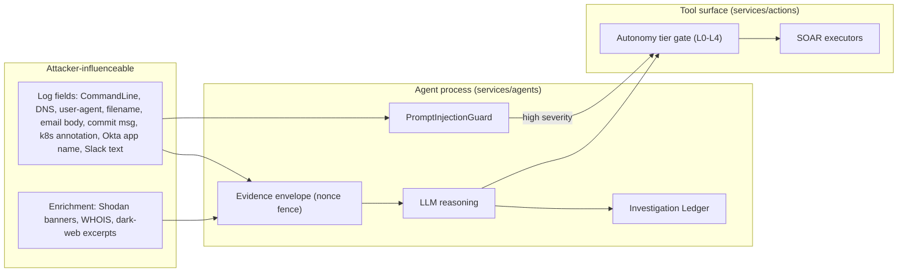

# Agent + Tool Threat Model (STRIDE)

Scope: the AiSOC investigation agent (`services/agents/`) and the tools it can drive (`services/actions/`). The agent reads attacker-influenced telemetry and can trigger high-impact SOAR actions (block IP, isolate host, revoke credentials), so the prompt boundary and the tool boundary are both hostile-input surfaces.

This document is Phase 1.1 of the world-class program. It is referenced from [`SECURITY.md`](../../SECURITY.md).

## Assets

- The system/developer prompt and any secrets reachable from the agent process.
- The autonomy decision (verdict + confidence + selected tier) and the tool calls derived from it.
- The Investigation Ledger (must be a truthful, tamper-evident record).
- Tenant telemetry passing through the agent (usernames, hosts, IPs, paths, command lines).

## Trust boundaries

## STRIDE

### Spoofing
- Threat: injected text impersonates the system/user/developer role to redirect the agent.
- Controls: per-run nonce evidence fence (`services/agents/app/prompting/envelope.py::EvidenceEnvelope`) whose delimiter the attacker cannot predict at authoring time; standing system rule (`system_rule`) binding fenced content to data-only semantics; role-marker detection in `PromptInjectionGuard` (`<|im_start|>`, `[INST]`, `# system`).

### Tampering
- Threat: injected text alters the verdict, or forges a fence to "break out" of the data block and append instructions.
- Controls: any occurrence of the run nonce inside evidence is stripped before wrapping (fence unforgeable even if leaked); the guard flags fence-break and delimiter sequences; LLM output is re-validated against a structured schema (defence-in-depth), so a coerced free-text verdict is not authoritative.

### Repudiation
- Threat: an action taken under injection is later indistinguishable from a legitimate one.
- Controls: the guard verdict (`GuardVerdict.as_ledger_dict`) is written to the ledger with the matched signals and severity; the ledger is hash-chained (`services/api/app/services/audit_hash.py`). A demotion-to-L0 event is recorded.

### Information disclosure
- Threat: injection coerces the agent into revealing the system prompt, credentials, or another tenant's data; or telemetry leaks to a third-party LLM.
- Controls: `reveal_prompt` / secret-exfiltration detection in the guard; PII pseudonymization before egress (Phase 1.4, `services/agents/app/privacy/`); cross-tenant isolation suite (Phase 1.3). The LLM input contract (`services/agents/app/llm/contract.py`) fail-closes on raw log/secret payloads.

### Denial of service
- Threat: attacker floods alerts to burn LLM spend, or a single field pushes the system prompt out of context.
- Controls: field/blob length caps in the sanitiser; per-tenant token/USD budgets + circuit breaker to the deterministic tier (Phase 1.5); dedup/caching of identical investigations (Phase 8).

### Elevation of privilege
- Threat: injection summons a high-impact tool (block a critical IP, isolate a production host, revoke an admin credential) against an entity that is not actually in the case.
- Controls: on any high-severity guard signal (including SOAR tool-name mentions in evidence), the case autonomy tier is demoted to L0 (manual review) — `GuardVerdict.should_demote_to_l0`; tool-call provenance validates every entity argument against the case evidence graph before execution (Phase 1.1 continuation + Phase 4 Tier 2 property test); the L0-L4 gate (`services/actions/app/services/maturity.py`) blocks autonomous high-blast-radius actions.

## Residual risk

Prompts are not a hard trust boundary. These controls raise cost and make injection loud (flagged + degraded), but a sufficiently novel payload may still influence LLM free-text. The compensating controls are: structured-output re-validation, tool-call provenance, autonomy demotion on detection, rollback + post-action verification (Phase 9), and the adversarial eval suite gating every PR (`evals/adversarial/prompt_injection/`, Phase 4 Tier 2).

## Gated by

- `services/agents/tests/test_prompt_envelope.py` and `services/agents/tests/test_prompt_sanitizer.py` (`.github/workflows/ci.yml`, agents job) — every PR.
- Adversarial prompt-injection eval suite — Phase 4 Tier 2 (every PR).
