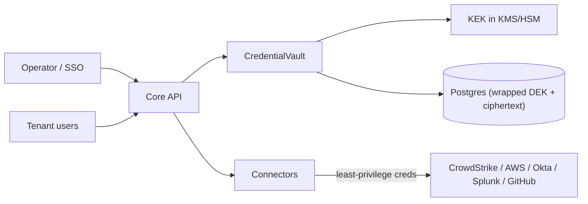

# Platform Threat Model (STRIDE)

Scope: the AiSOC platform as a whole, with the **credential vault as the top asset**. AiSOC's `CredentialVault` holds live credentials to CrowdStrike, AWS, Okta, Splunk, and GitHub. Compromising AiSOC compromises everything it connects to, so the platform's own security is a P0 product feature.

This document is Phase 1.6 of the world-class program. It is referenced from [`SECURITY.md`](../../SECURITY.md). The agent/tool surface has its own model in [`agent-threat-model.md`](agent-threat-model.md).

## Assets (ranked)

1. **Connector credentials** in the vault (`services/api/app/security/credential_vault.py`) — the crown jewels.
2. The KEK / `AISOC_CREDENTIAL_KEY` and any KMS key material.
3. Tenant data at rest (Postgres, ClickHouse, Neo4j, Qdrant, Redis, Kafka).
4. The audit log / Investigation Ledger (must be tamper-evident).
5. Platform admin + SSO/JWT signing secrets.

## Trust boundaries

## STRIDE

### Spoofing
- Threats: forged JWT/SSO to assume an operator/tenant; a connector impersonating another tenant.
- Controls: OIDC/SAML token issuance fails closed on placeholder secrets (`services/api/app/auth/`); per-request tenant binding (`app.current_tenant_id`) + query-layer `tenant_id` filters; API keys are vault-encrypted.

### Tampering
- Threats: editing ciphertext in the DB; altering the audit trail.
- Controls: authenticated encryption (Fernet HMAC / envelope DEK) makes tampered ciphertext fail closed; audit hash chain (`services/api/app/services/audit_hash.py`) makes ledger edits detectable; audit rows reject UPDATE/DELETE by the app role (Phase 3.1 gate).

### Repudiation
- Threats: an operator denies a credential change or an autonomous action.
- Controls: append-only audit log with actor + hash chain; ledger records the deciding model/tier.

### Information disclosure (top risk for this asset)
- Threats: a DB dump or leaked `AISOC_CREDENTIAL_KEY` exposes every connector credential; plaintext secrets in logs.
- Controls:
  - **Envelope encryption** (`services/api/app/security/envelope_cipher.py`, Phase 1.6): each secret is encrypted with a per-secret DEK; the DEK is wrapped by a KEK that never leaves KMS/HSM (`AwsKmsKeyManager`; GCP KMS / Vault Transit implement the same `KeyManager` protocol). A DB dump yields only wrapped DEKs + ciphertext — useless without KMS `decrypt` permission. `LocalKeyManager` remains the default for hobby deploys.
  - Per-secret DEKs mean a single compromised DEK exposes one secret, not the whole vault.
  - Leaf-level encryption keeps structural fields queryable while every secret value is ciphertext.
  - The vault refuses to boot without a key outside development; plaintext keys never log.

### Denial of service
- Threats: flooding investigations to exhaust budget/compute (see agent model, Phase 1.5); KMS throttling.
- Controls: per-tenant cost governor (Phase 1.5); KMS calls are per-secret-write/rotation, not per-request, so KMS rate is bounded.

### Elevation of privilege
- Threats: an over-scoped connector credential lets a vault compromise pivot into full cloud admin.
- Controls: **least-privilege connector scopes** ([`connector-least-privilege.md`](connector-least-privilege.md)) — document and audit the minimum IAM/API scope each connector needs; break-glass + rollback for autonomous actions (Phase 9).

## Key rotation (tested)

Rotation is a **re-wrap**, not a re-encrypt of every secret body:

1. Provision a new KEK in KMS (or add a new `LocalKeyManager` primary, keeping the old as historical).
2. Run `EnvelopeCipher.rewrap(token)` over every stored token: the DEK is unwrapped with its original KEK and re-wrapped with the current one. The ciphertext body is untouched and the plaintext never leaves KMS's reach.
3. Retire the old KEK once no token references it.

Gated by `services/api/tests/test_envelope_cipher.py` (round-trip, rotation + re-wrap, plaintext-never-in-token, fail-closed on tamper/wrong-KEK).

## Residual risk

A live KMS `decrypt` permission on the running API host is still a compromise path (the app must be able to decrypt to use credentials). Mitigations: scope the KMS key policy to the API role only, enable KMS CloudTrail on `decrypt`, and alert on anomalous decrypt volume. HSM-backed KEKs raise the bar further.
