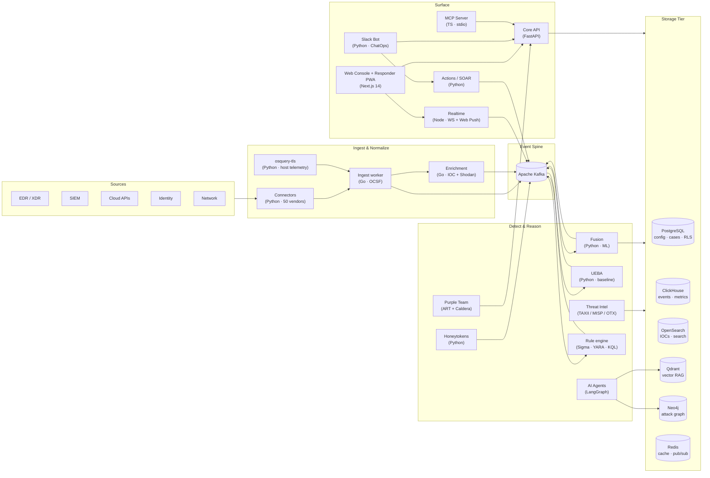

# Cyble AiSOC — Platform

> **Working prototype of the agentic SOC platform** described in [`../cyble-aisoc-plan.md`](../cyble-aisoc-plan.md).
>
> The production codebase lives at **[github.com/beenuar/AiSOC](https://github.com/beenuar/AiSOC)** (v7.3.1, approaching v8.0).
> This `platform/` directory is the local development sandbox.
>
> Five purpose-built agents (mirroring the production four-agent façade + Reporter),
> MCP-aligned tool registry, three-tier episodic memory, mock SIEM/EDR/IDP/CTI integrations,
> and a case-centric analyst console with live agent transparency.
>
> Runs offline with a deterministic mock LLM. Plug in `OPENAI_API_KEY` or
> `ANTHROPIC_API_KEY` and toggle `AISOC_LLM_PROVIDER` to use a real model.

---

## Changelog

### 2026-05-20 (today)
- **Security: Cross-tenant RBAC isolation** — isolation tests for `/alerts`, threat-intel, and LLM credentials now run in CI nightly (`cross-tenant-rbac.yml`). Any dropped `tenant_id` predicate produces a failing test. (PR [#197](https://github.com/beenuar/AiSOC/pull/197))
- **Agents: DetectAgent → FusionEngine wiring** — `DetectAgent.process()` now routes raw alerts through the `FusionEngine` via cross-service HTTP (`POST /process` on `services/fusion`). Dedup, ML scoring, confidence labelling, and RBA apply identically whether the alert arrived via Kafka or a direct call. (PR [#198](https://github.com/beenuar/AiSOC/pull/198))
- **Deps: `vitest` 2.1.9 → 4.1.6, `@vitejs/plugin-react` 4.7.0 → 6.0.2** — dev tooling only; no production code or behaviour changed. (PRs [#178](https://github.com/beenuar/AiSOC/pull/178), [#179](https://github.com/beenuar/AiSOC/pull/179), [#193](https://github.com/beenuar/AiSOC/pull/193))

### 2026-05-19
- **Console v1.5 — Investigation Rail (W6 / PR-4)** — `/alerts` is now a two-pane workbench: narrative, related-entity chips, 6-event mini-timeline, recommended actions. Fusion writes a deterministic correlation narrative at fuse time.
- **Console v1.5 — Investigation Queue (PR-5 / W7)** — `/queue` page: server-anchored SLA countdowns, atomic claim semantics, one-click triage actions.
- **Console v1.5 — Rule Tuning workbench (PR-6 / W8)** — `/detection/tuning` ranks noisy rules by precision impact; one-click suppression + allow-list edits with full audit trail.
- **Console v1.5 — Operations Funnel + Pipeline Health** — new `/metrics/funnel` and `/health/pipeline` endpoints feed the `FunnelKpiBar` (Detected → Triaged → Investigated → Resolved) and an Efficiency Report.
- **Console v1.5 — Critical severity tier** — severity ladder is now `info | low | medium | high | critical`. Vendor-native criticals (Azure, GCP SCC, GitHub, ServiceNow P1, GuardDuty ≥ 8.0, etc.) map through instead of being collapsed into `high`. Confidence (`alert.confidence`, 0–100) is now decoupled from severity, emitted by `ConfidenceScorer` in `services/fusion`.
- **Console v1.5 — Global time-window selector** — one selector at the topbar drives every page; deep-linkable as a URL param.
- **Console v1.5 — Tenant switcher + role badge** — MSSP operators flip tenants from the topbar; new endpoint `GET /api/v1/tenants/me/identity`.
- **v8.0 wave-1 — Four-agent façade** — `DetectAgent`, `TriageAgent`, `HuntAgent`, `RespondAgent` are now the public API; back-compat aliases preserve existing imports.
- **v8.0 wave-1 — Graph at ingest** — Neo4j entity graph (17 node labels, 14 edge types) written inline with Kafka consumption. Batched UNWIND upserts + fire-and-forget retry queue keep ingest latency intact.
- **v8.0 wave-1 — `/hunt` natural-language surface** — type a hypothesis in English; get ES|QL / SPL / KQL templates; save and schedule. HuntAgent never writes raw queries.
- **v8.0 wave-1 — 16 first-party connectors added** — wave-1: `tines`, `torq`, `falco`, `pagerduty`, `opsgenie`, `confluence_audit`; wave-2 fixtures: `cloudflare_zt`, `sysdig`, `vault`, `snowflake`.
- **v8.0 wave-1 — L0–L4 automation maturity model** — ladder: L0 manual → L4 fully autonomous closure with human sign-off.
- **v8.0 wave-1 — Public weekly benchmark scoreboard** — `benchmark-scoreboard.mdx` reads `scoreboard.json`, refreshed weekly by `wet-eval.yml`.
- **v8.0 wave-1 — Zero-prerequisite installer** — `install.sh` / `install.ps1` bootstrap from a clean machine (Docker, Compose, Node, pnpm, Python) with idempotency and graduated `uninstall.sh`.
- **Security — 12 CVE-class fixes** — `eval()` RCE in rule engine eliminated; `/hunts` and `/cases` tenant isolation enforced at query layer; CORS lockdown; playbook SSRF guard; plugin-manager OCI install hardening; JWT secret entropy gate; audit-log bypass closed; SSRF via connector `callback_url`; LLM prompt-injection classifier; detection content XSS; honeytoken leak in error response; replay-attack prevention on HITL approval tokens.
- **Attack Chain timeline UI** — `/cases/{id}` Attack Chain tab visualises ranked timeline from `/v1/cases/{id}/attack-chain`; entity-graph summary panel; MITRE technique chips; 5-tier severity ladder throughout.

### 2026-05 (earlier in month)
- Production domain migrated to `tryaisoc.com` (Fly.io, v7.x line). All `aisoc.dev` references purged.
- Three-tier agent memory shipped: session (in-process LRU), working (Redis 24 h TTL), institutional (PostgreSQL + pgvector, permanent).
- MCP server (`services/mcp/`) shipping 13 tools for Claude Desktop / Cursor / Continue / Cody.
- Responder PWA (`/responder/*`) with passkey login (WebAuthn / FIDO2), approvals queue, VAPID Web Push, offline shell.
- MSSP parent-tenant console: cross-tenant KPIs, child-tenant onboarding, delegated action management.
- Asset inventory with auto-correlation of vulnerabilities to alerts, blast-radius surfacing.
- Knowledge-base + RAG: ingest runbooks/SOPs, query with natural language, LLM-synthesised answer with citation.
- Natural-language detection authoring and closed-loop detection engineering (false-positive → auto Sigma fix → DAC proposal).

---

## Quickstart

```bash
cd platform
make install     # one-time: creates .venv, installs deps  (~30s)
make dev         # starts backend (8478) + frontend (8479), opens browser
```

In a second terminal:

```bash
make demo        # populates dashboard by running agents on 10 curated cases
```

That's it. Open <http://localhost:8479> and you'll see the analyst console.

To stop: `Ctrl-C` in the `make dev` terminal, or `make stop` from another shell.

> **Production equivalent:** `git clone https://github.com/beenuar/AiSOC && cd AiSOC && pnpm aisoc:demo`
> — one command, prebuilt images from `ghcr.io/beenuar/*`, up in ~3.5 min with a LockBit 3.0 ransomware showcase already mid-investigation.

---

## What you get

### Triage Queue
- 20 seeded alerts across phishing, lateral movement, ransomware staging, MFA bombing, BEC, cloud misconfig, false positives, and benign noise.
- One click runs the full agent mesh against any case.
- Severity (5-tier: `info | low | medium | high | critical`), status, verdict, confidence, MITRE techniques — all visible at a glance.

### Case Detail
- Auto-generated narrative from the **Reporter** agent.
- Full evidence panel: source alert, IOCs, response actions taken.
- **Agent transparency panel** on the right — every step of every agent's reasoning, tool call, decision, with risk-classified actions and HITL flags. Click any step to see the raw tool result.

### Hunter Workspace
- Type a hypothesis; the **HuntAgent** (v8.0 façade, formerly Hunter Agent) picks tools, runs queries, and summarizes findings. Never writes raw queries — generates ES|QL / SPL / KQL templates instead.
- Four preset hunts: dark-web credential leak, exposed services, Cobalt Strike beacons, lateral-movement chains.

### Tool & Integration Registry
- 20 tools across SIEM, EDR, IDP, email security, ticketing, comms, and **5 Cyble-native CTI tools** (the moat).
- Each tool tagged with risk class: READ → WRITE-REVERSIBLE → WRITE-SIGNIFICANT → DESTRUCTIVE.
- Production catalog: 50 click-and-connect vendors spanning EDR/XDR, SIEM, cloud, identity, SaaS, VCS, container, and network.

### Manager Dashboard
- Auto-resolution rate, MTTR, MTTD, severity/status breakdown.
- Live agent activity feed via WebSocket.
- Operations Funnel KPI bar (Detected → Triaged → Investigated → Resolved).

---

## Architecture

### Local prototype (this directory)

```
                ┌─────────────────────────────────────────┐
                │           Analyst Console               │
                │   (React + Tailwind, 8479)              │
                └────────────────┬────────────────────────┘
                                 │ REST + WebSocket
                ┌────────────────▼────────────────────────┐
                │         FastAPI backend (8478)          │
                │  /alerts /cases /hunts /stats /tools    │
                │  /ws/events  (live agent activity)      │
                └────────────────┬────────────────────────┘
                                 │
        ┌────────────────────────┼────────────────────────┐
        │                        │                        │
   ┌────▼────┐         ┌─────────▼─────────┐      ┌──────▼──────┐
   │ Agents  │         │    Memory         │      │ Tool        │
   │ Planner │         │  Scratchpad       │      │ Registry    │
   │ Triager │◀───────▶│  Episodic (SQLite │      │ MCP-aligned │
   │ Invest. │         │   + embeddings)   │      │ Risk-tagged │
   │ Respdr. │         │  Threat graph stub│      └──────┬──────┘
   │ Reporter│         └───────────────────┘             │
   │ Hunter  │                                           ▼
   └─────────┘                                    Mock integrations
                                                  • splunk    • okta
                                                  • s1 EDR    • proofpoint
                                                  • cyble-cti  • slack
                                                  • cyble-darkweb / asm /
                                                    brand / vuln
```

### Production (v7.3.1 → v8.0, github.com/beenuar/AiSOC)

The production stack is a 22-service pnpm monorepo with a Kafka event spine and six dedicated storage systems. The prototype above implements a slice of this architecture for local iteration.



### The agent mesh (v8.0 four-agent façade)

**v8.0 rebrand** (2026-05-19): `DetectAgent`, `TriageAgent`, `HuntAgent`, `RespondAgent` are now the public façade. Back-compat aliases preserve existing imports. `ReporterAgent` continues as the narrative-finalization step.

```
DetectAgent (raw alert ingestion, routes to FusionEngine via HTTP)
     │
     ▼
TriageAgent (Tier-1 verdict: BENIGN / SUSPICIOUS / MALICIOUS / ESCALATE)
     │ escalate
     ▼
[LangGraph multi-step Investigator]
     │ case_complete
     ▼
HITL Gateway (analyst reviews, approves via Console / Slack / Teams)
     │ approved
     ▼
RespondAgent (blast-radius-aware containment, L0–L4 gated)
     │ actions_executed
     ▼
ReporterAgent (case narrative, compliance artifacts, weekly digest)

HuntAgent (out-of-band, hypothesis-driven, natural-language → ES|QL/SPL/KQL)
```

Iteration is capped; every step is traced for replay.

### L0–L4 Automation Maturity Model (added 2026-05-19)

| Level | Name | What AiSOC does |
|---|---|---|
| L0 | Manual | Surface alerts; analyst does everything |
| L1 | Assisted | AI triage + investigation narrative; human executes |
| L2 | Semi-autonomous | AI executes WRITE-REVERSIBLE actions automatically; WRITE-SIGNIFICANT requires one analyst |
| L3 | Supervised autonomous | AI executes up to WRITE-SIGNIFICANT; DESTRUCTIVE requires 2+ senior analysts |
| L4 | Fully autonomous | AI closes cases autonomously with per-action confidence thresholds; full audit gate log |

Tenant admins configure the maturity level and per-action confidence thresholds via API. All guard-rail decisions are logged.

### Trust & safety
- Tools risk-classified: READ / WRITE-REVERSIBLE / WRITE-SIGNIFICANT / DESTRUCTIVE.
- HITL gate triggers above `AISOC_REQUIRE_HITL_ABOVE` (default `WRITE-REVERSIBLE`).
- Per-action confidence thresholds (e.g. `block_ip ≥ 0.90`, `close_alert ≥ 0.60`).
- Every tool call is persisted with params, result, success, duration, HITL approver.
- Every agent step (think / plan / tool / decision / handoff) is traced for replay in the Investigation Ledger.
- Cross-tenant isolation enforced at query layer (not just RLS) — nightly RBAC regression gate in CI.
- Playbook SSRF guard: every outbound HTTP call runs through `ssrf_guard.py` with cloud-metadata block list.
- Rule engine `eval()` replaced with whitelisted AST parser (CVE-class fix, 2026-05-19).

---

## File map

```
platform/
├── backend/
│   ├── app/
│   │   ├── main.py                 # FastAPI entrypoint
│   │   ├── config.py               # Pydantic settings (env-driven)
│   │   ├── db.py                   # SQLite engine + session helper
│   │   ├── seed.py                 # 20 seed alerts + 5 IOCs
│   │   ├── models/                 # SQLModel tables (OCSF-aligned)
│   │   │   ├── alert.py case.py trace.py tool_call.py ioc.py memory.py
│   │   ├── agents/
│   │   │   ├── orchestrator.py     # Planner — agent mesh router
│   │   │   ├── base.py             # BaseAgent: trace + call_tool + HITL
│   │   │   ├── triager.py          # TriageAgent: first-pass verdict
│   │   │   ├── investigator.py     # Deep evidence gathering (LangGraph)
│   │   │   ├── responder.py        # RespondAgent: containment playbooks
│   │   │   ├── reporter.py         # Narrative + close + record memory
│   │   │   ├── hunter.py           # HuntAgent: hypothesis-driven hunting
│   │   │   └── llm.py              # Mock / OpenAI / Anthropic shim
│   │   ├── tools/                  # MCP-aligned tool registry
│   │   │   ├── registry.py         # Decorator + risk classifier
│   │   │   ├── siem.py edr.py cti.py idp.py email_tool.py ticketing.py comms.py
│   │   ├── memory/
│   │   │   ├── scratchpad.py       # Per-case key-value (Redis-equivalent in proto)
│   │   │   ├── embedding.py        # Hash-bag embedding (offline)
│   │   │   └── episodic.py         # Past-case similarity recall
│   │   │   # Production adds: session (LRU), working (Redis 24h), institutional (pgvector)
│   │   └── api/
│   │       ├── routes.py           # REST endpoints
│   │       └── events.py           # WebSocket event bus
│   ├── requirements.txt
│   ├── pyproject.toml
│   └── Dockerfile
├── frontend/
│   ├── index.html                  # Tailwind shell
│   └── app.js                      # React (CDN) — all views
├── scripts/dev.sh                  # `make dev` runner
├── docker-compose.yml
└── Makefile
```

Production adds `services/fusion/`, `services/ueba/`, `services/honeytokens/`, `services/purple-team/`, `services/threatintel/`, `services/mcp/`, `services/ingest/` (Go), `services/enrichment/` (Go), `services/osquery-tls/`, `services/osquery-extensions/`, `services/actions/`, `services/slack-bot/`, `services/realtime/` (Node.js), `services/connectors/`.

---

## Configuration

All knobs are env vars prefixed `AISOC_`. Defaults work out of the box.

| Variable | Default | Purpose |
|---|---|---|
| `AISOC_LLM_PROVIDER` | `mock` | `mock` (offline), `openai`, or `anthropic` |
| `AISOC_OPENAI_API_KEY` | — | Required for `openai` |
| `AISOC_ANTHROPIC_API_KEY` | — | Required for `anthropic` |
| `AISOC_LLM_MODEL` | `claude-3-5-sonnet-20241022` | Model name |
| `AISOC_AUTONOMY_LEVEL` | `supervised` | `off`, `supervised`, `autonomous` |
| `AISOC_REQUIRE_HITL_ABOVE` | `WRITE-REVERSIBLE` | HITL gate threshold |
| `AISOC_DB_PATH` | `data/aisoc.db` | SQLite path |
| `AISOC_SEED_ON_STARTUP` | `true` | Auto-seed empty DB |

Real LLM example:

```bash
export ANTHROPIC_API_KEY=sk-ant-...
export AISOC_LLM_PROVIDER=anthropic
make dev
```

---

## API

```
GET  /health              health
GET  /tools               list registered tools
GET  /cases               list cases (filters: status, severity)
GET  /cases/:id           case detail w/ alerts, traces, tool_calls
POST /cases/:id/rerun     re-run agent mesh on a case
POST /alerts              ingest a new alert (auto-creates case + runs agents)
POST /hunts               run hypothesis-driven hunt
GET  /stats               dashboard stats
WS   /ws/events           live agent activity stream
```

OpenAPI docs at <http://localhost:8478/docs>.

Production API (v1): `/api/v1/alerts`, `/api/v1/cases`, `/api/v1/hunts`, `/api/v1/detections`, `/api/v1/investigations`, `/api/v1/tenants/me/identity`, `/metrics/funnel`, `/health/pipeline`, `/api/v1/attack-chain/{case_id}`.

### Ingest a new alert programmatically

```bash
curl -X POST http://localhost:8478/alerts \
  -H 'Content-Type: application/json' \
  -d '{
    "external_id": "test-001",
    "source": "splunk",
    "title": "Test alert: suspicious PowerShell",
    "severity": "high",
    "src_user": "alice",
    "src_host": "WS-001",
    "process_name": "powershell.exe",
    "file_hash": "9c2a4e1a7b8d3f6e0c1b5a9d8e7f6c5b4a3d2e1f0c9b8a7d6e5f4c3b2a1d0e9f"
  }'
```

The agent mesh will run automatically. Open <http://localhost:8479> to watch.

---

## Demo script (3-minute tour)

1. **Manager dashboard** → see 20 cases seeded, 0% auto-resolved.
2. **Triage queue** → click "▶ Run agents on new cases" → watch statuses change in real time.
3. Open **case #1** (Suspicious PowerShell) → walk through:
   - Auto-narrative from Reporter explains the verdict.
   - Right panel: every TriageAgent → Investigator → RespondAgent → ReporterAgent step, expandable.
   - 3 containment actions executed (host isolated, file quarantined, sessions revoked).
4. **Hunter** → click preset "Look for credential leaks of cyble.com on dark-web" → see the HuntAgent pick `cti.darkweb_search`, run it, summarize.
5. **Tools** → 20 tools registered, 5 Cyble-native (the moat).
6. **Manager dashboard** → auto-resolution rate now 20%+, MTTR shown.

---

## What's mocked vs. real

| Real | Mocked |
|---|---|
| FastAPI + SQLModel persistence | LLM calls (toggle to real provider with one env var) |
| Agent orchestration & handoff contracts | SIEM / EDR / CTI / IDP responses |
| MCP-aligned tool registry with risk gating | Email message bodies |
| Episodic memory (SQLite + embeddings) | Cyble CTI feeds (returns realistic shapes) |
| WebSocket live activity bus | Slack / Jira / ticket creation |
| HITL approval gating semantics | Multi-tenancy enforcement |
| 5-tier severity (`info → critical`) | FusionEngine ML scoring |

Swapping a mock for a real integration = implement the same async function signature in a new file under `app/tools/`. The registry decorator does the rest.

---

## Roadmap to production

See [`../roadmap/12-month.md`](../roadmap/12-month.md) and the live [ROADMAP.md](https://github.com/beenuar/AiSOC/blob/main/ROADMAP.md) in the GitHub repo.

Production v7.3.1 already ships: real connectors (50 vendors), Postgres + Redis, Qdrant for vectors, Neo4j for threat graph, JWT auth + multi-tenant RLS, prompt-injection defenses, audit log to immutable store, ClickHouse for high-cardinality analytics, Kafka event spine, OpenSearch for IOC search, UEBA, Honeytokens, Purple Team, MCP server, Responder PWA with passkeys.

Near-term (v8.0): full v8.0 architectural wave (graph at ingest, natural-language hunt surface), benchmark scoreboard GA.

---

*Last updated: 2026-05-20 · Production version: v7.3.1 (v8.0 in progress) · tryaisoc.com*
